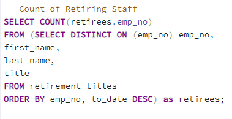
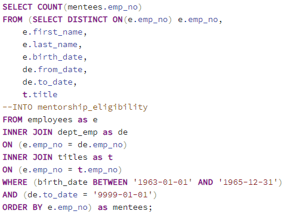
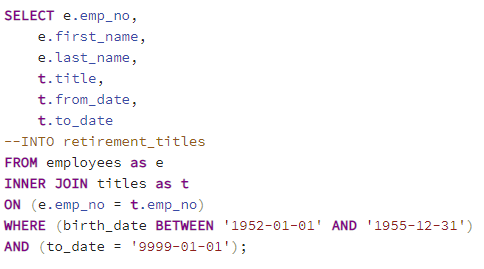
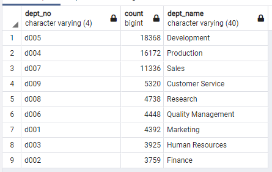
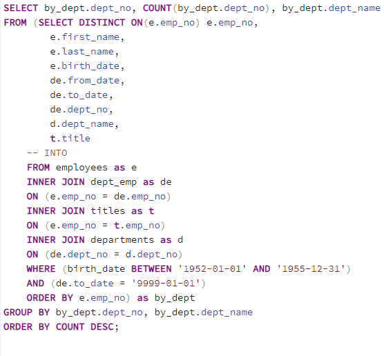

# Pewlett-Hackard-Analysis

## Overview/Purpose of the Analysis:
-Our company, Pewlett Hackard, is coming up on a time period where a record number of our employees will begin to retire, the so-called 'Silver Tsunami'. In order to avoid a crisis with so many people leaving at the same time. I was tasked with querying our newly created SQL database, to find the answers to the following questions:
 
 - How many people are retiring?
 - For each title, how many retirees do we have?
 - Which employees are eligible for the mentorship program?
 - We are looking to start a mentorship program within the company since we are losing so many senior members of our staff. We will compile a list of employees that are eligible for such a program.

## Results
### There were 4 major points that I need to bring forward: 
1. We have approximately 72,000 employees that will be retiring soon.
2. There are 7 different titles we will need to account for during the hiring process. Three out of the 7 are senior level positions.
3. Between our senior engineers and senior staff, we will retire almost 50,000 staff members. Finding enough qualified applicants for these roles may be difficult.
4. With the current eligibility parameters, there will only be 1,549 staff members that will be eligible for our mentorship programs. 

## Summary:

  * How many roles will need to be filled as the "silver tsunami" begins to make an impact? About ~72,400 will begin the process of retiring during this period.
  
  
  * Are there enough qualified, retirement-ready employees in the departments to mentor the next generation of Pewlett Hackard employees? There actually more than enough, with the parameters that we have initially set up there are only 1,549 eligible. We will need to expand the age range in order to better head off the upcoming hiring crisis. When I modify the birth dates to include everyone born from 1963 to 1965, we get around 38,000 qualified applicants to fill the soon-to-be vacant positions. Still not enough but much better. 
  

Additionally, I modified the first query, where we use WHERE statements to filter, I added the filter (to_date = '9999-01-01'). This indicates that the employee still works at the company. Not adding this parameter makes all over queries from its' base incorrect. We would not need employees in the data that do not currently work with us.

Lastly, I created a query that will tell us how many retirees we have per department. This info is also valuable and will allow us to break up this massive task.

